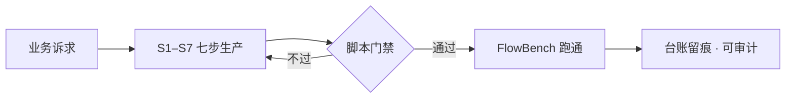
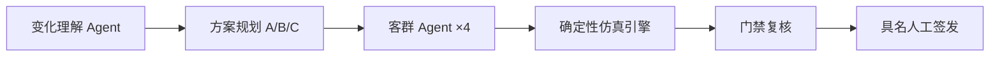

<div align="center">
  
</div>

<p align="center">
  两个围绕「用工程手段驯化 AI / LLM」的项目。一个把 AI 从不可信的黑盒，驯化成可控的生产工具；一个把多 Agent 系统做对——协作、确定性、人审、安全边界，缺一不可。
</p>

<p align="center">
  <span style="background-color:#8b5cf6; color:#ffffff; border-radius:20px; padding:5px 14px; font-size:12px; font-weight:600;">🧩 2 个完整项目</span>
  &nbsp;
  <span style="background-color:#0ea5e9; color:#ffffff; border-radius:20px; padding:5px 14px; font-size:12px; font-weight:600;">⚡ 零第三方依赖</span>
  &nbsp;
  <span style="background-color:#f59e0b; color:#ffffff; border-radius:20px; padding:5px 14px; font-size:12px; font-weight:600;">🛡️ 演示用 mock 数据</span>
</p>

---

## 项目

<div align="center">

<div style="background-color:#faf5ff; border:1px solid #e9d5ff; border-radius:18px; padding:26px 30px; text-align:left;">

  <div>
    <span style="background-color:#8b5cf6; border-radius:12px; padding:10px 12px; font-size:18px;">🧩</span>
    &nbsp;&nbsp;
    <span style="font-size:11px; letter-spacing:3px; color:#8b5cf6; font-weight:700;">PROJECT 01</span>
  </div>

  <div style="font-size:22px; font-weight:700; color:#1f2937; margin-top:16px;">评价域工作流生产 Skill</div>

  <div style="font-size:14px; color:#4b5563; margin-top:8px; line-height:1.8;">
    把「模糊的业务诉求」自动生产成「可上线、可复现的 LLM 工作流」。用 S1–S7 七步流程、脚本门禁和生产台账约束 Agent，把「告诉 AI 怎么做」升级成「确保 AI 做了」。
  </div>

  <div style="margin-top:18px; line-height:2.4;">
    <span style="background-color:#7c3aed; color:#ffffff; border-radius:8px; padding:4px 13px; font-size:13px; font-weight:700;">⚡ 26× 生产提速</span>
    &nbsp;
    <span style="background-color:#a78bfa; color:#ffffff; border-radius:8px; padding:4px 13px; font-size:13px; font-weight:700;">🎯 94% 盲测命中</span>
    &nbsp;
    <span style="background-color:#c4b5fd; color:#4c1d95; border-radius:8px; padding:4px 13px; font-size:13px; font-weight:700;">🧩 0 想象节点</span>
    &nbsp;
    <span style="background-color:#ddd6fe; color:#4c1d95; border-radius:8px; padding:4px 13px; font-size:13px; font-weight:700;">🛡️ 100% 稳定执行</span>
  </div>

  <div style="margin-top:16px;">
    <a href="./review-workflow-builder/README.md" style="color:#7c3aed; font-weight:700; font-size:13px; text-decoration:none;">查看项目 README →</a>
  </div>

</div>

<br />

<div style="background-color:#ecfeff; border:1px solid #cffafe; border-radius:18px; padding:26px 30px; text-align:left;">

  <div>
    <span style="background-color:#06b6d4; border-radius:12px; padding:10px 12px; font-size:18px;">🧭</span>
    &nbsp;&nbsp;
    <span style="font-size:11px; letter-spacing:3px; color:#0891b2; font-weight:700;">PROJECT 02</span>
  </div>

  <div style="font-size:22px; font-weight:700; color:#1f2937; margin-top:16px;">大型活动散场推演 Agent</div>

  <div style="font-size:14px; color:#4b5563; margin-top:8px; line-height:1.8;">
    一套本地可运行的「活动散场预演台」：多 Agent 并行意图、确定性仿真引擎、具名人工签发，回答普通路线推荐回答不了的问题——一群人同时离场时，方案到底成不成立。
  </div>

  <div style="margin-top:18px; line-height:2.4;">
    <span style="background-color:#0891b2; color:#ffffff; border-radius:8px; padding:4px 13px; font-size:13px; font-weight:700;">✅ 38 / 38 测试</span>
    &nbsp;
    <span style="background-color:#22d3ee; color:#083344; border-radius:8px; padding:4px 13px; font-size:13px; font-weight:700;">🚧 8 / 8 硬门槛</span>
    &nbsp;
    <span style="background-color:#67e8f9; color:#083344; border-radius:8px; padding:4px 13px; font-size:13px; font-weight:700;">📋 93 分审计</span>
    &nbsp;
    <span style="background-color:#a5f3fc; color:#083344; border-radius:8px; padding:4px 13px; font-size:13px; font-weight:700;">⚡ 16 分钟清场</span>
  </div>

  <div style="margin-top:16px;">
    <a href="./event-egress-agent/README.md" style="color:#0e7490; font-weight:700; font-size:13px; text-decoration:none;">查看项目 README →</a>
  </div>

</div>

</div>

<br />

<div align="center">
  
  <p style="font-size:12px; color:#6b7280; margin-top:6px;">散场推演 A/B/C 三方案审计结果（B 方案 16 分钟 0 溢出清场）</p>
</div>

---

## 架构速览

**项目一**把一条生产任务固化成可校验的流水线：



**项目二**让四个客群 Agent 并行表达意图、由确定性引擎统一结算：



---

## 技术栈

两个项目共用同一套底座，上层形态不同：

| 层 | 项目一 · 工作流生产 | 项目二 · 散场推演 |
|---|---|---|
| 后端 | Python 3.8+ · FlowBench | Python 3 · 确定性仿真引擎 |
| Agent | 单 Skill（S1–S7 门禁流水线） | 多 Agent（并行意图 / 单写者结算） |
| 前端 | 原生 HTML / JS | 原生 HTML / JS（桌面 + 移动） |
| 方法论 | 四层约束 · 盲测验收 | 五类合同 · 硬门禁评测 |

<p align="center">
  <span style="background-color:#3776ab; color:#ffffff; border-radius:8px; padding:5px 12px; font-size:12px; font-weight:600;">Python 3.8+</span>
  &nbsp;
  <span style="background-color:#059669; color:#ffffff; border-radius:8px; padding:5px 12px; font-size:12px; font-weight:600;">标准库 · 零依赖</span>
  &nbsp;
  <span style="background-color:#8b5cf6; color:#ffffff; border-radius:8px; padding:5px 12px; font-size:12px; font-weight:600;">Agent Skill</span>
  &nbsp;
  <span style="background-color:#0ea5e9; color:#ffffff; border-radius:8px; padding:5px 12px; font-size:12px; font-weight:600;">LLM 工作流</span>
  &nbsp;
  <span style="background-color:#e34f26; color:#ffffff; border-radius:8px; padding:5px 12px; font-size:12px; font-weight:600;">原生 HTML / JS</span>
</p>

---

## 目录结构

```
ai-agent-portfolio/
├── review-workflow-builder/   项目一：评价域工作流生产 Skill + FlowBench 平台
└── event-egress-agent/        项目二：大型活动散场推演 Agent
```

## 运行

```bash
# 项目一：FlowBench 工作流平台
cd review-workflow-builder/platform && python platform.py        # http://127.0.0.1:8787

# 项目二：散场推演台
cd event-egress-agent && python3 server.py --port 8927          # http://127.0.0.1:8927
```

---

<div align="center">
  <sub style="color:#6b7280;">用工程手段驯化 AI，把「黑盒」变成「可复现的生产线」。</sub>
</div>
