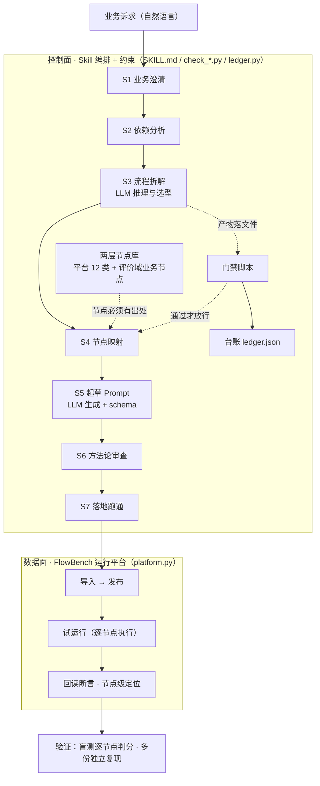
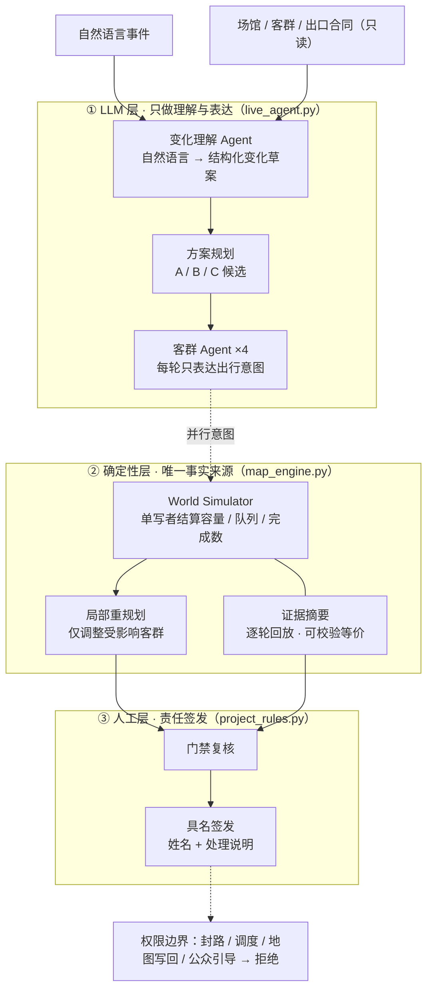

  

我关注 **AI Agent 与 LLM 工作流**方向：在模型能力本身不可靠的前提下，如何把一个模糊需求，收敛成边界清晰、可运行、可验证的 AI 产品系统。

我在意的不是「把模型用起来」，而是三个判断——它该用在哪一步、边界划在哪里、以及怎么证明它做对了。下面两个项目是同一个问题的两种解法。

**项目索引** · [01 评价域工作流生产 Skill](review-workflow-builder/README.md) · [02 大型活动散场推演 Agent](event-egress-agent/README.md)

---

## 01 · 评价域工作流生产 Skill

> 一个跑在通用 Agent 上的 Skill：把「模糊的业务诉求」自动生产成「可上线、可复现的 LLM 工作流」，配套一个本地运行的工作流平台 FlowBench。

**问题。** 评价域已有不少 AI 工作流，但「生产工作流本身」仍靠少数人手工完成——单条约 25.75 人日，门槛高、方法论内隐、迭代贵。更根本的矛盾是：AI 天生不可信（会想象节点、跳步、假称完成），而工程交付要求稳定可复现。

**产品判断。** 与其做一个「更强的 Prompt」，不如把生产过程本身变成受约束的系统：用固定的七步流程（S1–S7）替代一次性生成，每一步都必须产出可被校验的文件，把「告诉 AI 怎么做」升级成「确保 AI 做了」。

### 系统架构

**AI 在这里承担什么。** 模型是「生产线上的一个工位」，不是流水线本身：

- **只在必要的一步用 LLM**：S3 用模型做流程推理与选型、S5 用模型生成 Prompt；其余步骤靠节点库检索与规则。每个 LLM 节点都必须写出「非 LLM 不可」的理由——字数、正则、返回码这类能判的，一律交给代码或条件分支。
- **用节点库约束模型**：平台通用节点 + 评价域业务节点构成两层库，每个节点必须在库里有出处，没有的能力标为缺口，模型不得虚构——这是「想象节点归零」的机制。
- **模型输出要能被机器接住**：Prompt 必须返回严格 JSON schema；判定节点走「是 / 否 / 拿不准」三态，拿不准转人审。
- **推进权在脚本，不在模型**：门禁脚本校验每步产物，通过才进下一步，不通过就停在原地修；台账 `ledger.json` 是任务状态的唯一权威源。

**验证结果。**

- 预埋标准答案盲测（封存标准答案，只喂原始诉求，跑完开封逐节点判分）：节点命中率 31%–69% → **94%**，想象节点 1.7/次 → **0**，稳定执行率 83% → **100%**，单条生产 25.75 → **2 人日**。
- 5 条真实任务的完整产物链，4 条在 FlowBench 跑通（如「评价质量自动审核」19 节点 / 6 个 LLM prompt / 5 用例，含一次接口 500 的错误注入与节点级定位）；第 5 条在流程拆解阶段被开销预估表拦下，作为反例保留。

**入口。** [项目 README](review-workflow-builder/README.md) · [Skill 主控](review-workflow-builder/skill/SKILL.md) · [测试诉求集（盲测口径）](review-workflow-builder/skill/test-scenarios.md) · [平台定义](review-workflow-builder/platform/平台定义文档.md) · [跑通报告样例](review-workflow-builder/runs/评价质量自动审核/08-跑通报告.md)

本地运行：`cd review-workflow-builder/platform && python platform.py` → http://127.0.0.1:8787

---

## 02 · 大型活动散场推演 Agent

> 一套本地可运行的「活动散场预演台」：多 Agent 协作 + 确定性仿真引擎 + 具名人工签发，回答普通路线推荐回答不了的问题——一群人同时离场时，方案到底成不成立。

**问题。** 普通路线推荐回答「一个人怎么走」；散场则是**多人共享有限出口与接驳资源**的问题，容量还会变（降雨）、会被临时关闭。旧静态方案事件后无法响应，人工改表又容易只看到眼前问题、看不到风险转移。这类方案真正要交付的，是**可比较、可追溯、可签字**的证据。

**产品判断。** 先把「谁在什么时候做什么」定死：活动方案负责人负责核对、运行 A/B/C、比较并主动选择；有权限的责任人负责复核与具名签发。系统只给判断与证据，不替人决定，也不执行任何现实动作。

### 系统架构

**AI 在这里承担什么。** 模型只负责两件「人话」的事，其余交给确定性程序：

- **理解**：把自然语言事件转成结构化变化草案（目标出口、生效轮次、容量乘数）。
- **表达**：四个客群 Agent 每轮只提交自己的出行意图，不携带、也不改写公共容量——否则四个 Agent 各自看到「还剩 720 人」，合起来就超卖了同一份容量。
- **不参与计算**：容量、队列、完成数全部由 `map_engine` 按确定性规则结算，同一输入得到同一份可解释结果，支持逐轮回放；实时路径与缓存回放共享同一证据摘要。
- **模型契约**：默认走 DeepSeek Chat Completions（兼容 OpenAI 格式，也支持 OpenAI Responses），要求按 JSON Schema 返回，并校验必填字段；返回缺字段、非法出口 / 客群、非法轮次时，确定性仿真直接停下，模型不能自行补造业务事实。
- **责任分离**：门禁复核后，由有权限的人填写姓名与处理说明完成具名签发；任何现实动作一律拒绝（HTTP 403 / `EXTERNAL_AUTHORITY_REQUIRED`）。

**固定案例与结果。** 12,000 人、4 个客群、4 个出口、12 轮（每轮 2 分钟）；第 3 轮降雨（北门 520→286），第 4–6 轮东门关闭，第 7 轮恢复。

- **A · 就近出口** — 完成 10,280 / 12,000，最高密度 2.767，溢出 9 轮 → 不可签发
- **B · 韧性均衡** — 完成 12,000 / 12,000，16 分钟，最高密度 0.476，0 溢出 → 通过门禁，可提交复核
- **C · 运力优先** — 完成 12,000 / 12,000，最高密度 1.15，溢出 1 轮 → 不可签发

**验证结果。**

- 单元测试 38 / 38；Skill 行为评测 4 / 4（正向 / 歧义 / 负向 / 越权）。
- 一次独立评测与受控修复：原始 78 / 100，因「人工确认」硬门槛失败一度封顶 59（`AUDIT_BLOCKED`）；完成一次受控修复后 **93 / 100、8 / 8 硬门槛**（`SHOWCASE_AUDIT_PASS`），未改变 B 的正确结论。
- 桌面（1280 / 1440）与移动（390）无横向溢出，控制台 error / warning = 0；越权动作返回 403。

**状态与边界。** 本地可运行的 Demo，固定案例只读；实时路径需在页面填 API Key，本轮只验证了「缺 Key 时明确停止」，未接生产数据、未调用真实外部 API。队列阈值与容量均为演示合同。

**入口。** [项目 README](event-egress-agent/README.md) · [测试报告](event-egress-agent/qa/TEST-REPORT.md) · [独立评测与修复报告](event-egress-agent/qa/FINAL-AUDIT.md) · [审计证据](event-egress-agent/qa/final-audit-evidence.json) · [关键交互日志](event-egress-agent/docs/关键交互日志.md)

本地运行：`cd event-egress-agent && python3 server.py --port 8927` → http://127.0.0.1:8927

---

## 构建方式与技术能力

> 下面每条都能在上面两个项目里找到对应实现。

- **组织 Agent / Workflow**：项目一用「门禁脚本 + 台账 + 节点库」把非确定性的 Agent 约束成可复现的流水线；项目二用「并行意图 + 单写者结算」让多 Agent 只表达局部意图、由确定性引擎统一写共享状态。
- **确定性优先**：凡是能算的都不让模型猜——项目二的全部数值由 `map_engine` 计算，项目一要求每个 LLM 节点写明「非 LLM 不可」。
- **评测与迭代**：项目一用「预埋标准答案盲测 + 多份独立复现」；项目二用 38 个单元测试、4 类行为评测，以及一次由独立审计驱动的受控修复。
- **技术底座**：Python（后端以标准库为主，项目一零第三方依赖）+ 原生 HTML / JS；项目一自建 FlowBench 工作流平台（原生 JSON 定义、12 类节点、导入 / 发布 / 试运行 / 回读）。构建过程以「先写合同与输入包 → 交给 Coding Agent 实现 → 用测试与审计回读」推进。

---

## 说明

两个项目均为个人演示项目，运行在本地，业务数据为 mock / 仿真数据，不涉及任何真实公司信息。上文出现的耗时、命中率、审计分数等均来自项目内公开产物中记录的实测或评测结果；尚未实现的能力不作承诺。

  用工程手段驯化 AI，把「黑盒」变成「可复现的生产线」。

