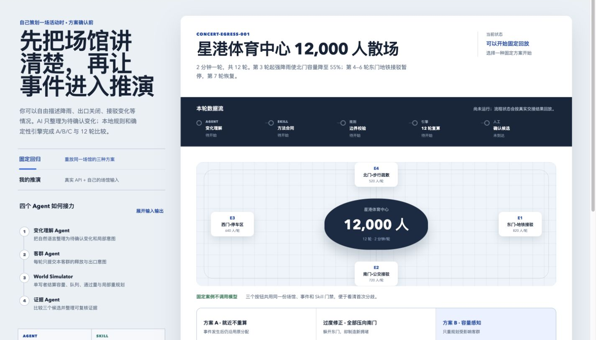

<div align="center">
  
</div>

两个围绕「用工程手段驯化 AI / LLM」的项目。一个把 AI 从不可信的黑盒，驯化成可控的生产工具；一个把多 Agent 系统做对——协作、确定性、人审、安全边界，缺一不可。所有业务数据均为演示用 mock 数据，不涉及任何真实公司信息。

---

## 项目

<div align="center">

<div style="text-align:left; border:1px solid #e2e0f3; border-radius:14px; padding:24px 28px; box-shadow:0 1px 3px rgba(139,92,246,0.08);">
  <div style="font-size:11px; letter-spacing:3px; color:#8b5cf6; font-weight:600; margin-bottom:6px;">PROJECT 01</div>
  <div style="font-size:20px; font-weight:600; color:#24292f;">评价域工作流生产 Skill</div>
  <div style="font-size:14px; color:#57606a; margin-top:8px; line-height:1.7;">
    把「模糊的业务诉求」自动生产成「可上线、可复现的 LLM 工作流」。用 S1–S7 七步流程、脚本门禁和生产台账约束 Agent，把「告诉 AI 怎么做」升级成「确保 AI 做了」。
  </div>
  <div style="margin-top:16px; font-size:14px; color:#24292f;">
    <b style="color:#7c3aed;">26 倍</b> 生产提速 &nbsp;·&nbsp; <b style="color:#7c3aed;">94%</b> 盲测命中 &nbsp;·&nbsp; <b style="color:#7c3aed;">0</b> 想象节点 &nbsp;·&nbsp; <b style="color:#7c3aed;">100%</b> 稳定执行
  </div>
  <div style="margin-top:18px;">
    <a href="./review-workflow-builder/README.md" style="font-size:13px; font-weight:600; color:#8b5cf6; text-decoration:none;">查看项目 README →</a>
  </div>
</div>

<br />

<div style="text-align:left; border:1px solid #cfeff2; border-radius:14px; padding:24px 28px; box-shadow:0 1px 3px rgba(6,182,212,0.08);">
  <div style="font-size:11px; letter-spacing:3px; color:#0891b2; font-weight:600; margin-bottom:6px;">PROJECT 02</div>
  <div style="font-size:20px; font-weight:600; color:#24292f;">大型活动散场推演 Agent</div>
  <div style="font-size:14px; color:#57606a; margin-top:8px; line-height:1.7;">
    一套本地可运行的「活动散场预演台」：多 Agent 并行意图、确定性仿真引擎、具名人工签发，回答普通路线推荐回答不了的问题——一群人同时离场时，方案到底成不成立。
  </div>
  <div style="margin-top:16px; font-size:14px; color:#24292f;">
    <b style="color:#0e7490;">38 / 38</b> 测试通过 &nbsp;·&nbsp; <b style="color:#0e7490;">8 / 8</b> 硬门槛 &nbsp;·&nbsp; <b style="color:#0e7490;">93 分</b> 独立审计
  </div>
  <div style="margin-top:18px;">
    <a href="./event-egress-agent/README.md" style="font-size:13px; font-weight:600; color:#0891b2; text-decoration:none;">查看项目 README →</a>
  </div>
</div>

</div>

<br />

<div align="center">
  
</div>

---

## 技术栈

两个项目共用同一套技术底座：**Python 3.8+**（标准库实现，零第三方依赖）、**通用 Agent Skill**（跨平台格式）、**原生 HTML / JS**（响应式前端）。差异在于上层形态——项目一是自建的 LLM 工作流平台 FlowBench，项目二是多 Agent 确定性仿真系统。

| 层 | 项目一 · 工作流生产 | 项目二 · 散场推演 |
|---|---|---|
| 后端 | Python 3.8+ · FlowBench | Python 3 · 确定性仿真引擎 |
| Agent | 单 Skill（S1–S7 门禁流水线） | 多 Agent（并行意图 / 单写者结算） |
| 前端 | 原生 HTML / JS | 原生 HTML / JS（桌面 + 移动） |
| 方法论 | 四层约束 · 盲测验收 | 五类合同 · 硬门禁评测 |

## 目录结构

```
ai-agent-portfolio/
├── review-workflow-builder/   项目一：评价域工作流生产 Skill + FlowBench 平台
└── event-egress-agent/        项目二：大型活动散场推演 Agent
```

## 运行

```bash
# 项目一：FlowBench 工作流平台
cd review-workflow-builder/platform && python platform.py        # http://127.0.0.1:8787

# 项目二：散场推演台
cd event-egress-agent && python3 server.py --port 8927          # http://127.0.0.1:8927
```

---

<div align="center">
  <sub>用工程手段驯化 AI，把「黑盒」变成「可复现的生产线」。</sub>
</div>
