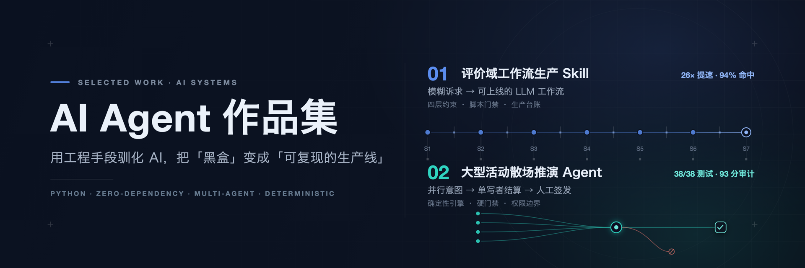

  

我关注 **AI Agent 与 LLM 工作流**方向：在模型能力本身不可靠的前提下，如何把一个模糊需求，收敛成边界清晰、可运行、可验证的 AI 产品系统。

我在意的不是「把模型用起来」，而是三个判断——它该用在哪一步、边界划在哪里、以及怎么证明它做对了。下面两个项目是同一个问题的两种解法：一个约束「用 AI 生产 AI 工作流」的过程，一个组织多个 Agent 在真实约束下协同。

---

## 精选项目

- **01 · [评价域工作流生产 Skill](review-workflow-builder/README.md)** — 把模糊的业务诉求，自动生产成可上线、可复现的 LLM 工作流。
- **02 · [大型活动散场推演 Agent](event-egress-agent/README.md)** — 用多 Agent 与确定性引擎做对散场推演：协作、确定性、人工责任与安全边界。

### 01 · 评价域工作流生产 Skill

> 一个跑在通用 Agent 上的 Skill：把「模糊的业务诉求」自动生产成「可上线、可复现的 LLM 工作流」，并配套一个本地运行的工作流平台 FlowBench。

**问题。** 评价域里已经有不少 AI 工作流，但「生产工作流本身」仍靠少数人手工完成——单条约 25.75 人日，能力门槛高、方法论内隐、迭代成本高。更根本的矛盾是：AI 天生不可信（会想象节点、跳步、假称完成），而工程交付要求稳定、可复现。

**产品判断。** 我没有去做一个「更强的 Prompt」，而是把生产过程本身变成一个受约束的系统：用固定的七步流程（S1–S7）替代一次性生成，每一步都必须产出可被校验的文件，把「告诉 AI 怎么做」升级成「确保 AI 做了」。

**系统设计 —— 四层约束。**

- **L1 信息层**：两层节点库（平台通用节点 + 评价域业务节点）与方法论规则集。每个节点必须在库里能找到出处，库里没有的能力标记为缺口，不得虚构——这是「想象节点归零」的关键。
- **L2 流程层**：门禁脚本接管推进权。每步产物通过结构校验才允许进入下一步，不通过就停在原地修，不许跳步、不许口头声称完成。
- **L3 状态层**：生产台账 `ledger.json` 是任务状态的唯一权威来源，支持断点续跑、防覆盖与事件审计。
- **L4 验证层**：在自建的 FlowBench 上真实导入、发布、试运行并回读断言，把结果落回平台闭环。

此外，生成与审查分离（S6 只出审查报告、不改方案）；线上发现 bad case 时走七段归因回流，并从归因定位的步骤级联重开下游——不允许带着 `passed` 的下游账目去改上游。

**验证证据。**

- **预埋标准答案盲测**：封存一条真实工作流的标准答案，只喂原始业务诉求，跑完后开封逐节点判分。节点命中率从 31%–69% 提升到 **94%**，想象节点从平均 1.7 个/次降到 **0**，流程稳定执行率从 83% 提升到 **100%**；单条生产耗时从 25.75 人日降到 **2 人日**（约 26 倍）。
- **5 条真实任务的完整产物链**（画像 → 依赖 → 拆解 → 节点方案 → prompts → 审查 → dsl → 跑通报告 → 画布）：4 条在平台跑通，例如「评价质量自动审核」19 节点 / 6 个 LLM prompt / 5 个用例全部通过，其中包含一次接口 500 的错误注入与节点级定位。
- **一个反例**：「存量评价全量重打标」在流程拆解阶段被开销预估表拦下而终止。它被有意保留在仓库里，用来证明方法论真的会拦人，而不是一路绿灯。

**深入了解。**

- [项目 README](review-workflow-builder/README.md) · [Skill 主控 `SKILL.md`](review-workflow-builder/skill/SKILL.md) · [测试诉求集（含盲测口径）](review-workflow-builder/skill/test-scenarios.md)
- [平台定义文档](review-workflow-builder/platform/平台定义文档.md) · 产物样例：[跑通报告](review-workflow-builder/runs/评价质量自动审核/08-跑通报告.md) · [画布快照](review-workflow-builder/runs/评价质量自动审核/09-画布.html)
- 本地运行：`cd review-workflow-builder/platform && python platform.py` → http://127.0.0.1:8787

### 02 · 大型活动散场推演 Agent

> 一套本地可运行的「活动散场预演台」：多 Agent 协作 + 确定性仿真引擎 + 具名人工签发，回答普通路线推荐回答不了的问题——一群人同时离场时，方案到底成不成立。

**问题。** 普通路线推荐回答「一个人怎么走」；散场则是**多人共享有限出口与接驳资源**的问题，出口容量还会变（降雨）、会被临时关闭。旧的静态方案在事件发生后无法响应，人工改表又容易只看到眼前问题、看不到风险转移。这类方案真正要交付的，是**可比较、可追溯、可签字**的证据。

**产品判断 —— 谁在什么时候做什么。** 我把「直接用户」和「最终责任人」分开：活动方案负责人负责核对输入、运行 A/B/C、比较并主动选择；有权限的责任人负责复核与具名签发。系统只提供判断与证据，不替人选择、不替人签发；任何现实动作（封路、运力调度、地图写回、公众引导）一律拒绝。

**系统设计 —— 把「模型理解、脚本计算、人签发」切成清晰边界。**

- **并行意图 + 统一写入**：四个客群 Agent 每轮只表达自己的出行意图，不直接修改共享容量；由确定性引擎作为共享容量的唯一结算者——否则四个 Agent 各自看到「南门还剩 720 人」，合起来就超卖了同一份容量。
- **确定性引擎**：所有中间数值由确定性规则计算而非模型生成，同一输入稳定得到同一份可解释结果，支持逐轮回放；实时路径与缓存回放共享同一证据摘要，可校验等价性。
- **五类合同**（世界 / 方案 / 事件 / 意图 / 证据）在进入 Coding 前先定死，消除规则歧义。
- **局部重规划**：事件后只调整受影响客群，并设触发 / 对象 / 选择 / 比例 / 权限 / 证据六类限制，避免把瓶颈从一个门搬到另一个门。

**固定案例与回归结果（只读基线）。** 12,000 人、4 个客群、东/南/西/北 4 个出口、共 12 轮（每轮 2 分钟）；第 3 轮降雨（北门容量 520→286），第 4–6 轮东门关闭，第 7 轮恢复。

| 方案 | 完成人数 | 最高密度 | 溢出轮次 | 结论 |
|---|---|---:|---:|---|
| A · 就近出口 | 10,280 / 12,000 | 2.767 | 9 | 不可签发 |
| B · 韧性均衡 | 12,000 / 12,000 | 0.476 | 0 | 通过门禁，可提交复核 |
| C · 运力优先 | 12,000 / 12,000 | 1.15 | 1 | 不可签发 |

> 「最高密度」为共享出口的仿真队列密度指标，其阈值来自演示合同。B 方案以 16 分钟、0 溢出完成清场。

**验证证据。**

- **单元测试 38 / 38**、**Skill 行为评测 4 / 4**（正向 / 歧义 / 负向 / 越权四类）。
- **一次独立评测与受控修复**：原始 78 / 100，因「人工确认」硬门槛失败一度封顶 59（`AUDIT_BLOCKED`）；完成一次受控修复（修复三类高影响问题）后 **93 / 100、8 / 8 硬门槛**（`SHOWCASE_AUDIT_PASS`），且没有改变 B 方案的正确结论。
- 桌面（1280 / 1440）与移动（390）均无横向溢出，控制台 error / warning = 0；越权动作返回 HTTP 403 / `EXTERNAL_AUTHORITY_REQUIRED`。

**当前状态与边界。** 这是一个本地可运行的 Demo，固定案例只读；实时路径需在页面填写 API Key，本轮只验证了「缺 Key 时明确停止」，未接入生产数据、未调用真实外部 API。队列阈值与容量均为演示合同，不构成现实安全评估或任何官方标准。

**深入了解。**

- [项目 README](event-egress-agent/README.md) · [测试报告](event-egress-agent/qa/TEST-REPORT.md)
- [独立评测与修复报告](event-egress-agent/qa/FINAL-AUDIT.md) · [审计证据 JSON](event-egress-agent/qa/final-audit-evidence.json)
- [从想法到可运行 Demo 的关键交互日志](event-egress-agent/docs/关键交互日志.md)
- 本地运行：`cd event-egress-agent && python3 server.py --port 8927` → http://127.0.0.1:8927

---

## 构建方式与技术能力

> 下面每一条，都能在上面两个项目里找到对应实现。

- **Agent / Workflow 的组织**：项目一用「门禁脚本 + 生产台账 + 两层节点库」，把非确定性的 Agent 约束成可复现的七步流水线；项目二用「并行意图 + 单写者结算」，让多个 Agent 只表达局部意图、由确定性引擎统一写共享状态。
- **确定性优先**：凡是能算的，不让模型猜。项目二的容量、队列、完成数全部由确定性规则计算；项目一要求每个 LLM 节点都写出「非 LLM 不可」的理由。
- **模块化与可复用**：项目一把一次性的生产经验沉淀成 Skill + 节点库 + 方法论 + 门禁脚本；项目二把规则抽成五类合同与输入契约。
- **评测与迭代**：项目一用「预埋标准答案盲测」逐节点判分，并把 Skill 复制成多份独立目录、对同一诉求各跑一遍来检查结构一致性；项目二用 38 个单元测试、4 类行为评测，以及一次由独立审计驱动的受控修复。
- **技术底座**：Python（两个项目后端均以标准库为主，项目一零第三方依赖）+ 原生 HTML / JS；项目一自建了 FlowBench 工作流平台（原生 JSON 定义、导入 / 发布 / 试运行 / 回读）。构建过程以「先写合同与输入包 → 交给 Coding Agent 实现 → 用测试与审计回读」的方式推进。

---

## 说明

两个项目均为个人演示项目，运行在本地，业务数据为 mock / 仿真数据，不涉及任何真实公司信息。上文出现的耗时、命中率、审计分数等，均来自项目内公开产物中记录的实测或评测结果；尚未实现的能力不作承诺。

  用工程手段驯化 AI，把「黑盒」变成「可复现的生产线」。

