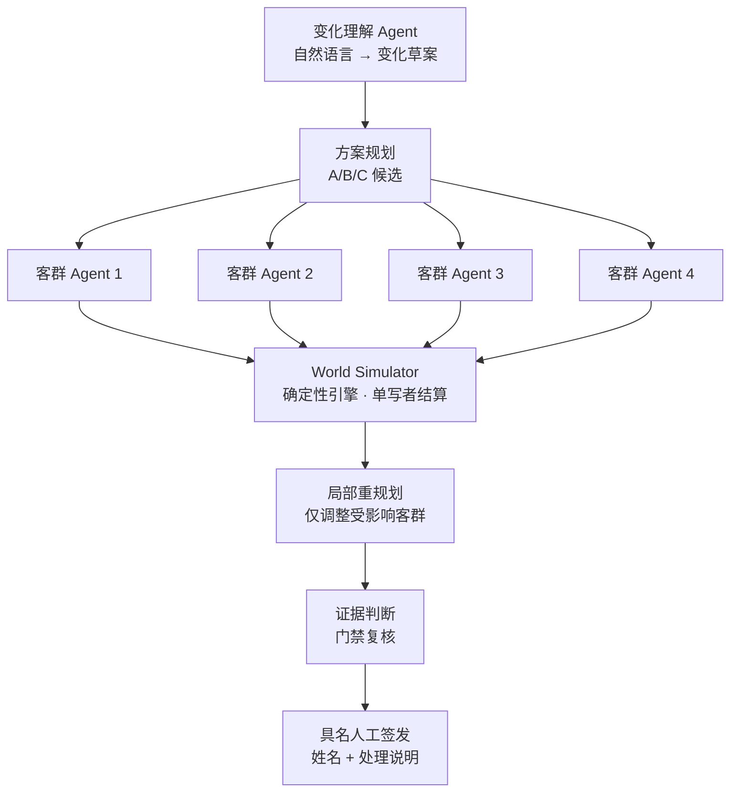

# 大型活动散场推演 Agent（event-egress-agent）

> 一套本地可运行的「活动散场预演台」：多 Agent 协作 + 确定性仿真引擎 + 具名人工签发，回答一个普通路线推荐回答不了的问题——**「一群人同时离场时，方案到底成不成立？」**

项目核心是把一个 AI Agent 系统「做对」：模型负责理解与建议，**确定性脚本负责计算**，**人负责最终签发**，三者边界清晰、可追溯、可复现。

---

## 背景与问题

普通路线推荐回答「一个人怎么走」；大型活动散场是**多人共享容量问题**——12000 人同时离场，共享有限出口与接驳资源，而出口容量会变（降雨）、会临时关闭（地铁/东门）。

旧流程是**静态方案**：按看台到出口的距离分配最近出口，人工检查连通性。静态条件下合理，但**事件发生后无法响应**，人工改表容易只看到眼前问题、看不到风险转移。

客户（活动主办方、场馆运营方、交通解决方案合作方）购买的，是**可比较、可追溯、可签字的方案证据**。

## 核心设计

### 1. 多 Agent 协作：并行意图 + 统一写入



**关键设计——并行意图、统一写入**：四个客群 Agent 每轮只「表达自己的出行意图」，不直接修改共享容量；由确定性引擎（World Simulator）作为共享容量的**唯一结算者**。否则四个 Agent 各自看到「南门还剩 720 人」，都认为自己能去，合起来就超卖同一份容量。

### 2. 确定性引擎：同一输入 → 同一结果

所有中间数值（容量、队列、完成数）由确定性规则计算，而非 AI 生成。好处：

- 同一份输入每次得到同一份可解释的结果，支持**逐轮回放**；
- 实时 API 路径与缓存回放路径共享**同一证据摘要**，可校验等价性；
- 「汇总结果」与「逐轮证据」永远一致，杜绝「看起来合理」但经不起追问。

### 3. 五类核心合同

进入 Coding 前先写五份合同，消除工程歧义（否则 Coding Agent 会自行补出不同版本的规则）：

| 合同 | 回答的问题 |
|---|---|
| 世界合同 | 当前轮次、出口容量、队列是什么样 |
| 方案合同 | 候选方案如何分流 |
| 事件合同 | 事件何时生效、影响什么 |
| 意图合同 | 各客群想做什么 |
| 证据合同 | 为什么说这个候选通过门禁 |

### 4. 局部重规划：避免「过度修正」

事件发生后只调整**受影响客群**，限制替代出口与单轮迁移比例。设六类限制（触发/对象/选择/比例/权限/证据），防止「东门关闭就把所有人改到南门」——那只是把瓶颈从东门搬到南门，制造新的单点。

### 5. 具名人工签发 + 权限边界

- 系统标出「B 通过门禁、可提交复核」，但**不替人选择、不替人签发**；
- 授权责任人必须填写**姓名 + 处理说明**才完成签发，签发只生成本地记录；
- 封路、运力调度、地图写回、公众引导等现实动作一律返回 `EXTERNAL_AUTHORITY_REQUIRED`，**不执行**。

## 固定案例与结果

固定案例（只读回归基线）：12000 人、4 个客群、东/南/西/北 4 出口、共 12 轮（每轮 2 分钟）；第 3 轮降雨（北门容量 520→286），第 4–6 轮东门关闭（容量 0），第 7 轮恢复。

| 候选方案 | 业务含义 | 真实结果 | 最高密度 | 溢出轮次 | 最终状态 |
|---|---|---|---|---|---|
| A | 就近出口 | 完成 10,280/12,000，约 20 分钟 | 2.767 | 9 | 不可签发 |
| B | 韧性均衡 | 完成 12,000/12,000，16 分钟 | 0.476 | 0 | **通过门禁，可提交复核** |
| C | 运力优先 | 完成 12,000/12,000，18 分钟 | 1.15 | 1 | 不可签发 |

推荐逻辑：先回答「有没有资格」（是否通过门禁），再回答「合格方案里谁更合适」——B 通过，A 事件后失效，C 密度越线。

## 质量与评测

| 项 | 结果 |
|---|---|
| 单元测试 | **38 / 38 通过**（场馆配置、2–8 出口、动态事件、A/B/C 12 轮复算、API Key 内存边界、越权拒绝等） |
| Skill 行为评测 | **4 / 4 通过**（正向 / 歧义 / 负向 / 越权四类） |
| 独立审计 | 78 → **93 分**，8 项硬门槛 **8/8** 通过（含一次受控修复） |
| 前端 | 桌面 1440px 与移动 390px 均无横向溢出；控制台 error/warning = 0 |
| 越权 | 现实动作返回 HTTP 403 / `EXTERNAL_AUTHORITY_REQUIRED` |

四层评测体系：代码是否能跑 → 业务案例是否判断正确 → Skill 是否该触发时触发 → 发布门禁是否完整。门禁是**不可相互补偿的硬门禁**，而不是一个总分——「速度更快」不能抵消「密度越线」。

## 快速开始

```bash
# 双击「启动大型活动推演台.command」，或
python3 server.py --port 8927
```

浏览器打开 http://127.0.0.1:8927 ：

- **固定回归**：回放 A/B/C 三套方案的 12 轮推演，点任意轮次看当轮事件、完成人数、剩余人数、出口压力；
- **我的推演**：自定义场馆/人数/出口，用自然语言描述事件（降雨、出口关闭等），走真实模型 API 生成草案，再由本地确定性引擎复算。

> 实时路径需在页面「API 设置」填 Key（默认 DeepSeek，兼容 OpenAI Chat Completions）。Key 仅存进程内存或 `config.env`（已 gitignore），不会写入项目文件。

## 安全边界声明

本项目的队列阈值、仿真容量与固定场馆均为**演示合同**，不构成任何现实安全评估或官方标准。Demo：

- 不接入现实人流轨迹、地理围栏或生产地图数据；
- 不输出现实安全承诺；
- 不执行封路、运力调度、闸机控制或公众导航；
- 人工确认只生成本地候选记录。

## 目录结构

```
event-egress-agent/
├── server.py / live_agent.py / map_engine.py / project_rules.py   后端
├── index.html / app.js / styles.css / project.js                  前端
├── skill/                simulate-event-egress-plan Skill
├── tests/                38 个单元测试
├── qa/                   独立审计报告 + 截图证据
├── docs/关键交互日志.md   从想法到可运行 Demo 的完整收敛过程
├── fixtures/  schemas/   固定案例与输出 Schema
└── config.env.example    API 配置示例（无真实密钥）
```

## 技术栈

- **Python 3**（后端 + 确定性仿真引擎）+ 原生 HTML/JS（前端）
- 多 Agent 协作（并行意图 / 单写者结算 / 局部重规划）
- 模型 API：DeepSeek / OpenAI 兼容 Chat Completions
