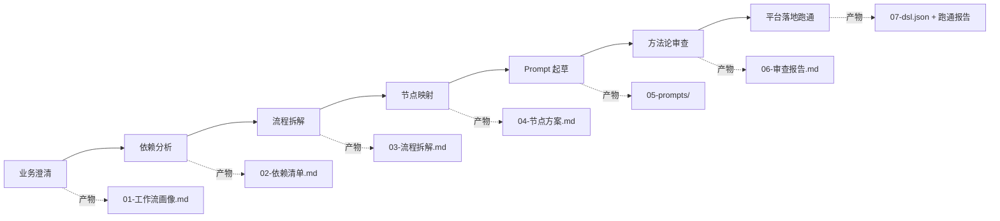

# 评价域工作流生产 Skill（review-workflow-builder）

> 把「模糊的业务诉求」自动生产成「可上线、可复现的 LLM 工作流」——一个跑在通用 Agent 上的 Skill，配套一个零依赖的本地工作流平台 FlowBench。

这是一个把不可信的 AI 黑盒「驯化」成工程级生产工具的项目：通过 **分层约束 + 脚本门禁 + 状态台账**，让 Agent 从一个会「想象节点、跳步、假称完成」的不可靠执行者，变成能够稳定产出可交付工作流的生产线。

---

## 背景与问题

电商评价域里有大量 AI 工作流（评价质量管控、评价总结与标签、B 端亮点挖掘、文案生成等），每一类都产生了正向业务价值，但**工作流本身的生产方式**存在三个结构性矛盾：

| 矛盾 | 表现 |
|---|---|
| **能力门槛高** | 设计一条工作流需同时具备业务理解、AI 边界判断、平台熟练度、Prompt 设计四种能力，团队里仅少数人能独立承接 |
| **方法论内隐** | 「哪些节点用 AI、哪些用 if-else、如何控制开销」这些经验沉淀在个人脑子里，无法复用 |
| **迭代成本高** | 从 0 到 1 搭建一条新场景工作流需约 1 个月，单条生产约 25.75 人日 |

核心挑战：**AI 的底层缺陷（不可信、偷懒、注意力衰减）与工程级交付的稳定性要求之间存在根本矛盾。**

## 成果指标

| 指标 | 前 | 后 |
|---|---|---|
| 单条工作流生产耗时 | 25.75 人日 | **2 人日（约 26 倍）** |
| 盲测节点命中率 | 31%–69%（R1） | **94%** |
| 想象节点数 | 平均 1.7 个/次 | **0** |
| 流程稳定执行率 | 83% | **100%** |
| 单次迭代成本 | 2.75 人日 | 约 0.5 人日 |

> 质量验证方式：**预埋标准答案盲测**——封存一条真实工作流的标准答案，只喂原始业务诉求，跑完开封逐节点判分（命中/漏掉/多出），而非让 Skill 自己测自己。

## 架构

一条生产任务走完 **S1–S7 七个步骤**，每一步产物落文件、由门禁脚本校验、状态由台账统一管理：



三个关键机制：

1. **门禁脚本接管推进权**：每步产物必须通过对应脚本的结构校验才能进入下一步；「门禁不过就停在原地修，不许跳步、不许口头声称完成」。
2. **生产台账（ledger.json）**：任务状态的唯一权威来源，产物落文件才算数，支持断点续跑、防覆盖（原子写）、事件流水可审计。
3. **两层节点库**：通用平台节点（11 类）+ 评价域业务节点。**每个节点必须在库内有出处，库里没有的能力标缺口，不得虚构**——这是「想象节点归零」的关键。

## 核心方法论

### 四层约束体系（最具迁移价值的部分）

把 AI 从「不可信黑盒」驯化为「可控生产工具」的分层框架，每一层针对性解决一种 AI 缺陷：

| 层 | 手段 | 解决的缺陷 |
|---|---|---|
| L1 信息层 | 两层节点库 + 方法论规则集 | 知识不足 → 想象节点归零 |
| L2 流程层 | 脚本门禁 + 模板校验 | 执行随意 → 结构稳定 |
| L3 状态层 | 台账化 + 文件驱动 | 偷懒/不可控 → 断点可续跑 |
| L4 验证层 | 平台闭环 + 评测指标 | 结果不可信 → 结果可验证 |

### 五条设计方法论（S6 强制审查清单）

1. **能不用 AI 就不用 AI**：字数/带图/返回码/正则可判的，一律用 code / if_else，每个 LLM 节点必须写出「非 LLM 不可」的理由。
2. **单节点单一任务**：一个 prompt 只解决一个问题，复合 prompt 输出不可控、不可测。
3. **开销意识**：量级 × 调用次数 = 开销，贵的步骤晚做少做，先过滤后进模型。
4. **沉淀 / 主链路解耦**：识别结果沉淀走旁路，不阻塞主链路。
5. **人审兜底 + 案例回流**：拿不准的必须有转人审出口，全自动无兜底的方案不许上。

## 迭代历程（R1 → R5）

| 轮次 | 做法 | 结果 |
|---|---|---|
| R1 全文投喂 | 把方法论文档一股脑喂给 AI 直接生成 | 想象节点出现、命中率 46%、三次测试不一致 |
| R2 结构化注入 | 拆成主控/方法论/话术/案例四模块 + 两层节点库 | 想象节点归零、命中率 78% |
| R3 脚本化门禁 | 每步产物落文件 + 门禁脚本校验 | 结构稳定，但发现 AI 偷懒 |
| R4 台账化 | 状态从对话搬进文件系统 | 断点续跑、对抗偷懒、可审计 |
| R5 平台闭环 | 推送平台试运行 + 回读报告 + 修正 | 建立 CI 式验证链路 |

> 关键认知：「想象节点」不是幻觉，而是**信息不足导致的合理外推**——不换模型，而是把推理空间收敛到平台真实能力范围内。

## 案例（`runs/` 目录）

每个目录是一次真实生产任务的完整产物链（画像 → 依赖 → 拆解 → 节点方案 → prompts → 审查报告 → dsl → 跑通报告 → 画布快照）：

| 案例 | 规模 | 状态 |
|---|---|---|
| 评价质量自动审核 | 19 节点 / 6 个 LLM prompt / 5 用例 | ✅ 跑通 |
| 追加评价引导文案 | 18 节点 / 2 个 LLM prompt / 4 用例 | ✅ 跑通 |
| 评价问答抽取 | 14 节点 / 1 个 LLM prompt / 4 用例 | ✅ 跑通（真实翻车一次后修复） |
| 晒图优选 | 15 节点 / 1 个 LLM prompt / 6 用例 | ✅ 跑通 |
| 存量评价全量重打标 | 停在 S4 | ⛔ 被开销预估表拦下（反例，见下） |

其中「存量评价全量重打标」是**故意保留的反例**：它想用大模型把全站历史评价重打一遍标，被 S3 的开销预估表否决——证明方法论真的会拦人，而不是一路绿灯。

## 快速开始

### 1. 起平台（3 分钟）

```bash
cd platform
python platform.py          # 默认 http://127.0.0.1:8787
```

浏览器打开 http://127.0.0.1:8787 ，导入 `platform/demo-scripts/demo_质量管控迷你.json` → 发布 → 试运行，即可看到节点级结果。详见 [`platform/启动手册.md`](platform/启动手册.md)。

### 2. 跑一条生产任务

向装了该 Skill 的 Agent 提出一个评价域工作流需求（例：「晒图优选，从带图评价里挑出能进晒图的内容」），Skill 会按 S1–S7 自动推进，最终在 FlowBench 上跑通。

## 目录结构

```
review-workflow-builder/
├── skill/                  Skill 本体（拷入 Agent 的 skills 目录）
│   ├── SKILL.md            主控：S1~S7 流程与门禁规则
│   ├── references/         节点库、方法论、prompt 范本、接口契约
│   └── scripts/            台账 + 门禁脚本 + 平台部署/运行脚本
├── platform/               FlowBench 工作流平台（本地运行版）
├── runs/                   5 个历史任务的全套产物
└── README.md
```

## 技术栈

- **Python 3.8+**（标准库实现，零第三方依赖）
- **通用 Agent**（Skill 格式，可跨平台）
- **FlowBench**：自建工作流平台，接口契约借鉴主流开源工作流平台（导入 / 发布 / 试运行 / 结果回读）
